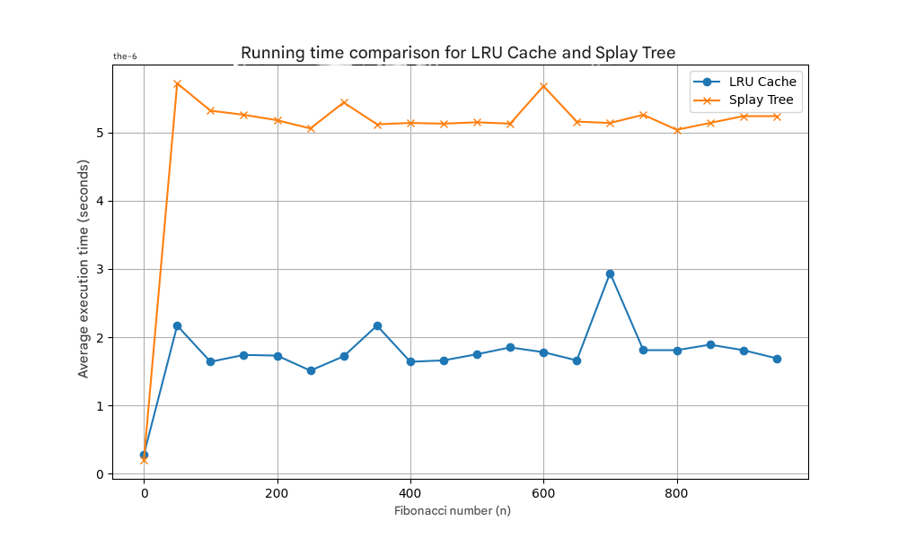
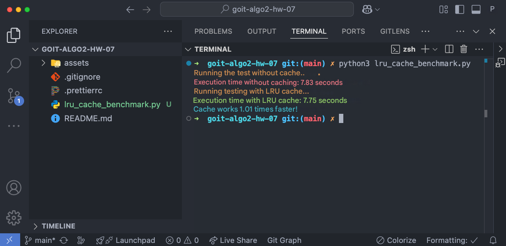
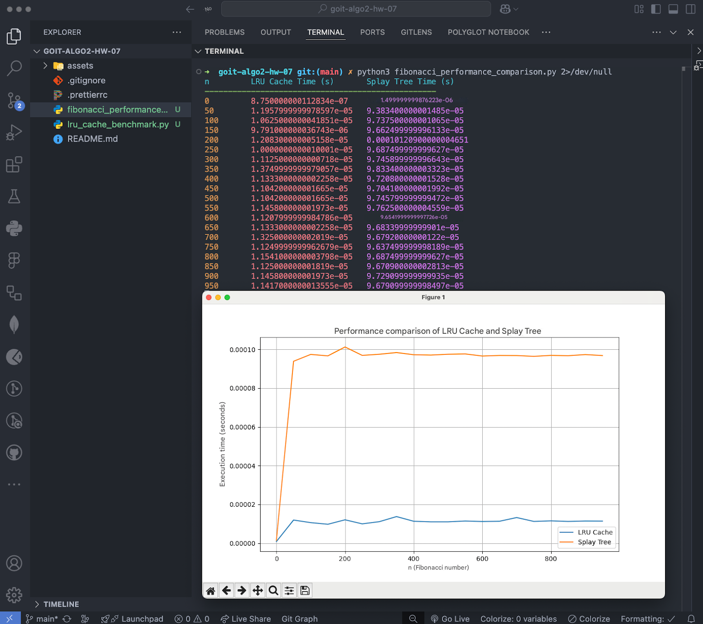

# Homework on the topic "Cache Management Algorithms"

## Task 1. Optimizing Data Access Using LRU Cache

Implement a program to optimize the processing of queries to an array of numbers
using LRU cache.

### Specifications

1. Given an array of size N, consisting of positive integers (1 ≤ N ≤ 100_000).
   It is necessary to process Q queries (1 ≤ Q ≤ 50_000) of the following type:

Range(L, R) — find the sum of elements in the range from index L to R inclusive.

Update(index, value) — replace the value of an element in the array at index
index with a new value value.

2. Implement four functions for working with an array:

range_sum_no_cache(array, L, R) The function should calculate the sum of the
elements of the array in the range from L to R inclusive without using the
cache. For each query, the result should be recalculated.

update_no_cache(array, index, value) The function should update the value of the
array element at the specified index without using the cache.

range_sum_with_cache(array, L, R) The function should calculate the sum of the
elements in the range from L to R inclusive, using the LRU cache. If the sum for
this range has already been calculated before, it should be returned from the
cache, otherwise the result is calculated and added to the cache.

update_with_cache(array, index, value) The function should update the value of
the array element at the specified index and remove all corresponding values
​​from the cache that have become irrelevant due to a change in the array.

3. To test the program, create an array of 100_000 elements filled with random
   numbers, and generate 50_000 Range and Update queries in a random order.

Example of a query list: [('Range', 46943, 91428), ('Range', 5528, 29889),
('Update', 77043, 78), ...]

4. Use an LRU cache of size K = 1000 to store pre-computed results of Range type
   queries. The cache should automatically delete the least recently used
   elements if its maximum size is reached.

5. Compare the query execution times:

- Without using the cache.

- Using the LRU cache.

- Output the results in the form of execution times for both approaches.

### Acceptance criteria

📌Homework acceptance criteria are a prerequisite for the mentor's consideration
of the homework. If any of the criteria are not met, the mentor sends the
homework for revision without grading. If you "just need to clarify"😉 or you
get stuck at some stage of execution — contact a mentor in Slack).

1. All functions: range_sum_no_cache, update_no_cache, range_sum_with_cache,
   update_with_cache — are implemented and working.

2. The program measures the execution time of queries with and without cache and
   displays the results in a clear form.

3. The test results are presented in an easy-to-understand format so you can
   evaluate the effectiveness of using the LRU cache.

4. The code executes without errors and meets technical requirements.

### Example of output to the terminal of the program execution

```bash
Execution time without caching: 3.11 seconds
Execution time with LRU cache: 0.02 seconds
```

## Task 2. Comparison of the performance of calculating Fibonacci numbers using LRU cache and Splay Tree

Implement a program for calculating Fibonacci numbers in two ways: using LRU
cache and using Splay Tree to store previously calculated values. Conduct a
comparative analysis of their efficiency by measuring the average execution time
for each approach.

### Specifications

1. Implement two functions for calculating Fibonacci numbers:

fibonacci_lru(n) The function must use the @lru_cache decorator to cache the
calculation results. Thanks to this, it can reuse previously calculated
Fibonacci numbers.

fibonacci_splay(n, tree) The function uses the Splay Tree data structure to
store the calculated values. If the Fibonacci number for the given n has already
been computed, the value should be returned from the tree, otherwise the value
is computed, stored in the Splay Tree, and returned.

2. Measure the execution time of computing the Fibonacci numbers for each of the
   approaches:

Create a set of Fibonacci numbers from 0 to 950 in steps of 50: 0, 50, 100, 150,
.... Use the mode l timeit to measure the execution time of the calculations.
For each value of n, calculate the average execution time of the Fibonacci
number calculation using the LRU cache and the Splay Tree.

3. Construct a graph that compares the execution time for the two approaches:

Use the matplotlib library to construct the graph. On the x-axis, display the
value of n — the Fibonacci number. On the y-axis — the average execution time in
seconds. Add a legend to the graph that indicates the two approaches: LRU Cache
and Splay Tree.

4. Draw conclusions about the efficiency of both approaches based on the
   resulting graph.

5. In addition to constructing the graph, output a text table that contains the
   value of n, the average execution time for the LRU Cache and the Splay Tree.
   The table should be formatted for easy reading.

### Acceptance Criteria

1. Implemented the fibonacci_lru and fibonacci_splay functions that calculate
   Fibonacci numbers using caching.

2. Measured the execution time for each approach at each value of n and built a
   graph showing the results.

3. The graph has axis labels, a title, and a legend explaining which method was
   used.

4. There is a formatted table with the results in the terminal.

5. Analyzed the results based on the resulting graph, demonstrating which
   approach is more efficient for calculating Fibonacci numbers at large values
   ​​of n.

6. The code is executable and meets the specifications.

### Example output table

```bash
n LRU Cache Time (s) Splay Tree Time (s)

0 0.00000028 0.00000020
50 0.00000217 0.00000572
100 0.00000164 0.00000532
150 0.00000174 0.00000526
```

### Example graph



## Preparing and uploading homework

1. Create a public repository goit-algo2-hw-07.

2. Complete the task and submit it to your repository.

3. Download the working files to your computer and attach them to the LMS in zip
   format. The archive name must be in the format DZ7_NAME.

4. Attach a link to the goit-algo2-hw-07 repository and send it for
   verification.

## Submission format

- Attached repository files in zip format with the name DZ7_NAME.

- Link to the repository.

## Assessment format

Pass / Fail

### Result of the completed DZ

#### Task 1



#### Task 2


